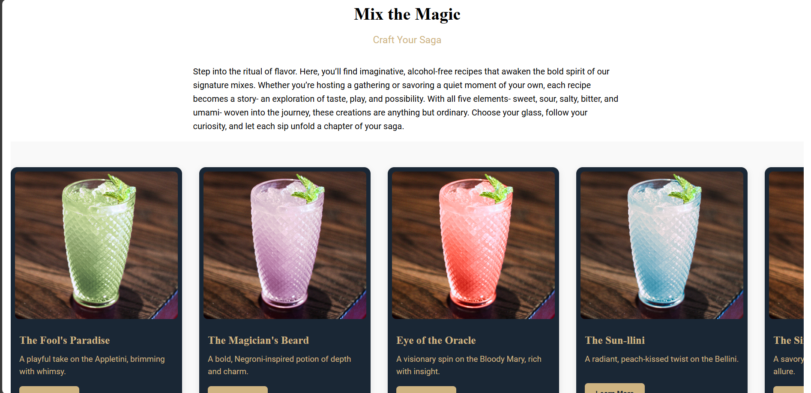
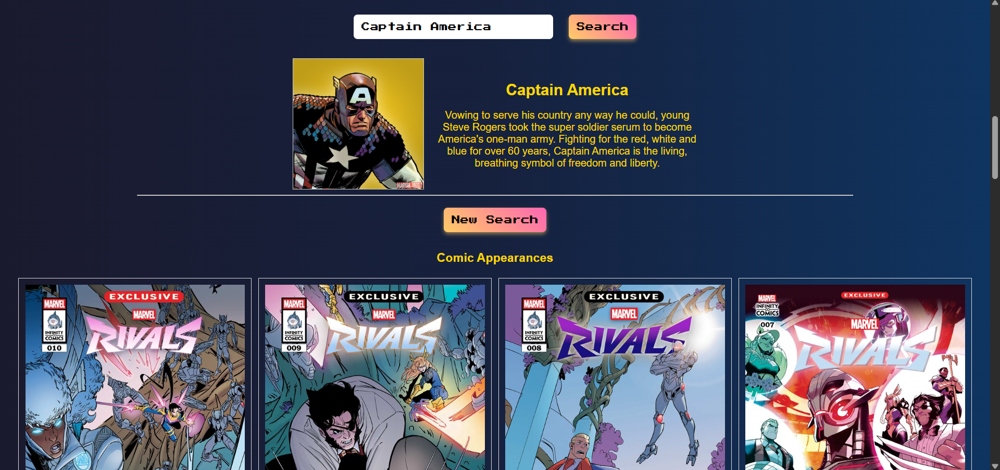

# 🧠 Royce LeDay  
**Versatile Designer/Developer | Ethical UX/UI | Web & Branding Specialist**  
*Design with intention. Code with clarity. Build for everyone.*

  

---

## 👋 About Me  
I'm a designer/developer hybrid with a passion for ethical, accessible, and user-centered digital experiences. Currently pursuing a B.S. in Graphic Information Technology at Arizona State University, I specialize in translating high-fidelity mockups into responsive, semantic code.

I thrive in solo builds where creative control meets technical precision, and I’m driven by workflows that respect users and elevate design intent. Outside of work, you’ll find me immersed in comics, action figures, video games, and cheering for my favorite teams.

---

## 🛠️ Skills & Tools  

| **Frontend**        | **Design**            | **Accessibility**               | **Workflow**               |
|---------------------|------------------------|----------------------------------|----------------------------|
| HTML, CSS, JS       | InDesign, Figma, Docs  | Semantic markup, ARIA, SVGs     | Modular CSS, Communication |

---

## 🚀 Featured Projects  

### 🔹 Velvet Hour  
A moody, scrollable recipe card interface with left-aligned text and modern color palette.  

### 🔹 Marvel API Implementation  
Searchable field using the Marvel API that loads clickable image results. Clicking on image launches a modal to give additional information. 

### 🔹 Image Comics Site/App Concept   
This is a fun project using a cdn to make a pdf reader to read comics.  

---

## 📬 Contact & Links  
- 📧 Email: [your.email@example.com](mailto:your.email@example.com)  
- 💼 LinkedIn: [linkedin.com/in/yourprofile](https://linkedin.com/in/yourprofile)
